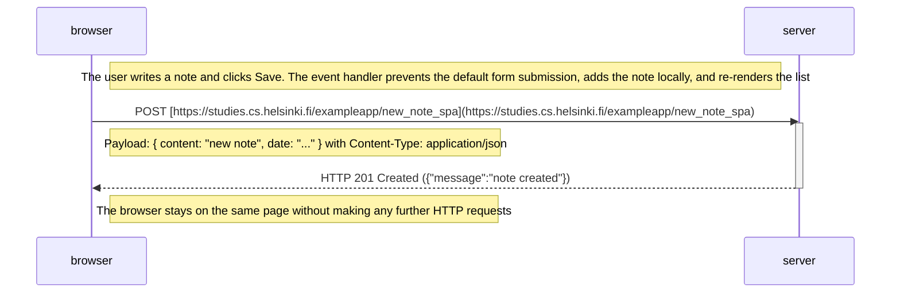

```mermaid
sequenceDiagram
    participant browser
    participant server

    Note right of browser: The user writes a note and clicks Save. The event handler prevents the default form submission, adds the note locally, and re-renders the list

    browser->>server: POST [https://studies.cs.helsinki.fi/exampleapp/new_note_spa](https://studies.cs.helsinki.fi/exampleapp/new_note_spa)
    activate server
    Note right of browser: Payload: { content: "new note", date: "..." } with Content-Type: application/json
    server-->>browser: HTTP 201 Created ({"message":"note created"})
    deactivate server

    Note right of browser: The browser stays on the same page without making any further HTTP requests
```